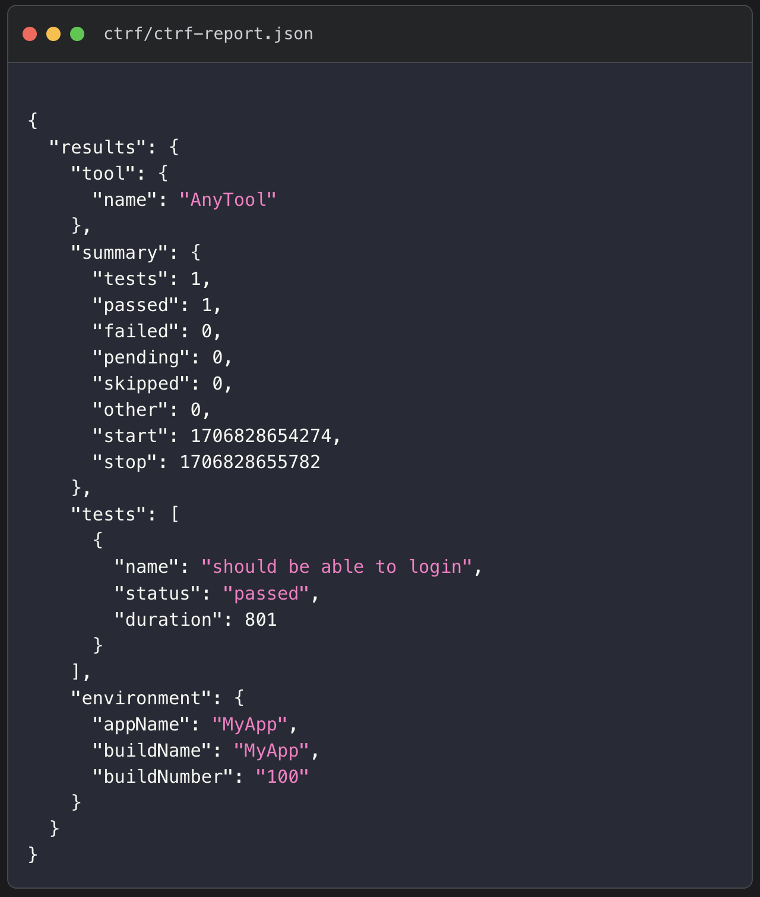

# Common Test Report Format

Generate the same JSON test report, no matter the test framework

CTRF is a unified JSON Test Report With Seamless Developer Tool Integration

You'll notice that v1 of the schema hasn't been released yet, we are still getting feedback from users. There might be changes but these will be minor.

💚
<h3 style="margin: 1rem 0;">CTRF tooling is open source and free to use</h3>

You can support the project with a follow and a star

Maintained by <a href="https://github.com/ma11hewthomas">Matthew Thomas</a> 
Contributions are very welcome!  

## Useful Links

<a href="https://ctrf.io/docs/intro">Docs</a>
 
<a href="https://ctrf.io/docs/schema/overview">Schema</a>
 
<a href="https://ctrf.io/integrations">Integrations</a>
 
<a href="https://github.com/orgs/ctrf-io/discussions">Discuss</a>
  

